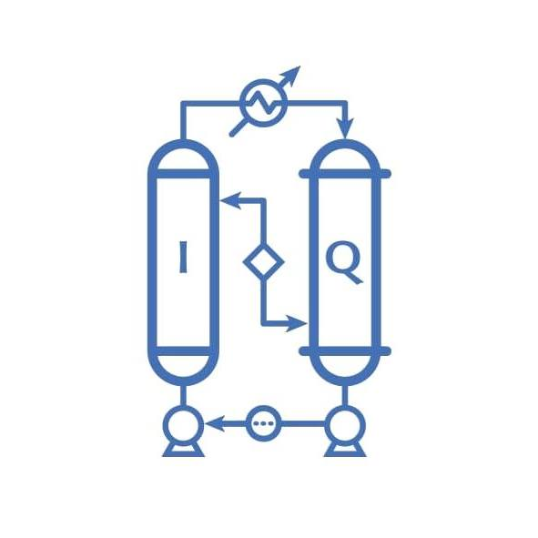

<div align="center">
  

  # EncuentroIQ — Sistema de Gestión y Evaluación

  **Plataforma integral para la publicación, evaluación y administración del Encuentro Estudiantil de Ingeniería Química**

  [](https://www.unam.mx/)
  [](https://script.google.com/)
  [](https://getbootstrap.com/)
  [](https://web.dev/progressive-web-apps/)
  [](https://developer.mozilla.org/en-US/docs/Web/JavaScript)
  [](LICENSE)

  <br/>

  [Descripción](#-descripción) •
  [Funcionalidades](#-funcionalidades) •
  [Arquitectura](#-arquitectura) •
  [Inicio rápido](#-inicio-rápido) •
  [Documentación](docs/) •
  [Contribuir](#-contribuir)

</div>

---

## 📋 Descripción

**EncuentroIQ** es un sistema web progresivo (PWA) diseñado para gestionar el ciclo completo del **Encuentro Estudiantil de Ingeniería Química**, evento académico que reúne a tres entidades de la UNAM: **Facultad de Química**, **FES Cuautitlán** y **FES Zaragoza**. Permite la publicación, evaluación y administración de trabajos académicos (modalidad oral y cartel) en un entorno tipo congreso.

> 🏛️ Desarrollado para la **Universidad Nacional Autónoma de México** — Comunidad de Ingeniería Química.

---

## ✨ Funcionalidades

### 👨‍🎓 Para Estudiantes
| Funcionalidad | Descripción |
|---|---|
| 📝 **Registro y autenticación** | Creación de cuenta con correo institucional |
| 📄 **Envío de trabajos** | Subida de PDF con título, resumen y modalidad (oral/cartel) |
| 🔍 **Seguimiento** | Dashboard con estado del trabajo y retroalimentación del comité |

### 👨‍🏫 Para Evaluadores
| Funcionalidad | Descripción |
|---|---|
| ⚖️ **Evaluación Fase 1** | Rúbrica de revisión documental (0–100 pts) con sliders interactivos |
| 🎤 **Evaluación Fase 2** | Evaluación de presentaciones orales y cartel en vivo con rúbricas específicas |
| 📅 **Agenda en vivo** | Consulta de asignaciones y horarios durante el evento |
| 🏆 **Resultados** | Visualización de ganadores por categoría |

### 👑 Para Administradores
| Funcionalidad | Descripción |
|---|---|
| 📋 **Panel centralizado** | Dashboard con estadísticas y tabla de progreso filtrable |
| 🔄 **Asignación de evaluadores** | Distribución manual o aleatoria de trabajos entre evaluadores |
| ✅ **Dictaminación masiva** | Finalización de evaluaciones con cálculo de puntajes |
| 📅 **Gestión de horarios** | Programación de presentaciones por sede y modalidad |
| 🏆 **Generación de certificados** | Creación automatizada desde plantilla de Google Docs |
| 📊 **Encuestas** | Visualización de respuestas de satisfacción |

### 🛠️ Sistema
| Funcionalidad | Descripción |
|---|---|
| 📱 **PWA** | Instalable en dispositivos, soporte offline parcial |
| 🔐 **Recuperación de contraseña** | Autogestionada vía correo electrónico |
| 📊 **Encuesta de satisfacción** | Formulario integrado con escala de estrellas |

---

## 🏗️ Arquitectura

```
┌─────────────────────────────────────────────────────────┐
│                    Frontend (Static PWA)                 │
│  HTML5 + Bootstrap 5.1 + Vanilla JS (ES6+) + CSS3       │
│  Service Worker · Web App Manifest · Tema UNAM          │
└─────────────────────┬───────────────────────────────────┘
                      │ HTTPS / JSON
                      ▼
┌─────────────────────────────────────────────────────────┐
│              Backend (Google Apps Script)                │
│  Code.gs — doGet() / doPost() REST-like API             │
│  • Autenticación por token · Sesión vía sessionStorage  │
│  • CRUD trabajos, evaluaciones, asignaciones            │
│  • Lógica de dictaminación y horarios                   │
│  • Generación de certificados (Google Docs API)         │
└────────┬──────────────────────────────┬─────────────────┘
         │                              │
         ▼                              ▼
┌─────────────────┐          ┌──────────────────────┐
│  Google Sheets   │          │    Google Drive       │
│  • Usuarios      │          │  • PDFs de trabajos   │
│  • Trabajos      │          │  • Plantillas Docs    │
│  • Evaluaciones  │          │  • Certificados       │
│  • Asignaciones  │          └──────────────────────┘
│  • Horarios      │
│  • Ganadores     │
│  • Encuestas     │
│  • Configuracion │
│  • Profesores    │
│  • Certificados  │
└─────────────────┘
```

---

## 🚀 Inicio rápido

### Prerrequisitos

- Una cuenta de Google Workspace (para Google Apps Script)
- Navegador moderno (Chrome, Edge, Firefox, Safari)

### Configuración del backend

1. Abre [Google Apps Script](https://script.google.com/) y crea un nuevo proyecto
2. Copia el contenido de `Code.gs` en el editor
3. Configura las **hojas de cálculo** de Google Sheets (Usuarios, Trabajos, Evaluaciones, Asignaciones, Horarios, Ganadores, Encuestas, Configuracion, Profesores, Certificados)
4. Despliega el script como **Aplicación web**:
   - Ejecutar como: `Yo`
   - Acceso: `Cualquier persona`
5. Copia la URL desplegada

### Configuración del frontend

1. Clona este repositorio:
   ```bash
   git clone https://github.com/congresolabiq/EncuentroIQ.git
   ```
2. Abre `js/config.js` y pega la URL del despliegue:
   ```js
   const GOOGLE_SCRIPT_URL = 'https://script.google.com/macros/s/TU_ID/exec';
   ```
3. Sirve los archivos con cualquier servidor estático:
   ```bash
   # Python
   python -m http.server 8000

   # Node.js
   npx serve .
   ```

---

## 📁 Estructura del proyecto

```
├── 📄 index.html                 # Página principal
├── 📄 login.html                 # Inicio de sesión
├── 📄 register.html              # Registro de usuarios
├── 📄 student-dashboard.html     # Panel de estudiante
├── 📄 evaluator-dashboard.html   # Panel de evaluador
├── 📄 admin-dashboard.html       # Panel de administración
├── 📄 submit-work.html           # Envío de trabajos
├── 📄 encuesta-satisfaccion.html # Encuesta de satisfacción
├── 📄 reset-password.html        # Recuperar contraseña
├── 📄 set-new-password.html      # Nueva contraseña
├── 📄 download.html              # Descargas
├── 📄 Code.gs                    # Backend (Google Apps Script)
├── 📄 service-worker.js          # Service Worker PWA
├── 📄 manifest.json              # Manifiesto PWA
├── 📁 css/
│   └── 🎨 style.css              # Estilos UNAM
├── 📁 js/
│   ├── ⚙️ config.js              # URL del backend
│   ├── 🔌 api-client.js          # Cliente API
│   ├── 🧠 app.js                 # Lógica de aplicación
│   └── 📋 evaluation-assignment.js # Asignación de evaluaciones
├── 📁 assets/                    # Iconos PWA
└── 📁 docs/                      # Documentación
```

---

## 🛠️ Stack tecnológico

| Capa | Tecnología |
|---|---|
| **Frontend** | HTML5, CSS3 (Custom Properties), Bootstrap 5.1, JavaScript ES6+ |
| **Backend** | Google Apps Script |
| **Base de datos** | Google Sheets (10 hojas de cálculo) |
| **Almacenamiento** | Google Drive (PDFs, plantillas Docs) |
| **Autenticación** | Token-based + sessionStorage |
| **PWA** | Service Worker (cache-first + stale-while-revalidate) |
| **Tipografía** | Roboto + Roboto Slab (Google Fonts) |
| **Colores institucionales** | Azul `#003D79` · Oro `#D59F0F` |

---

## 📚 Documentación

| Cuadrante | Propósito | Enlace |
|---|---|---|
| 📖 **Tutoriales** | Aprender paso a paso | [docs/tutorials/](docs/tutorials/) |
| 🔧 **Guías prácticas** | Resolver problemas específicos | [docs/how-to/](docs/how-to/) |
| 📚 **Referencia** | Consulta técnica detallada | [docs/reference/](docs/reference/) |
| 💡 **Explicación** | Comprender la arquitectura | [docs/explanation/](docs/explanation/) |

---

## 🤝 Contribuir

1. Haz fork del repositorio
2. Crea una rama (`git checkout -b feature/nueva-funcionalidad`)
3. Realiza tus cambios
4. Haz commit (`git commit -m 'Descripción del cambio'`)
5. Push a la rama (`git push origin feature/nueva-funcionalidad`)
6. Abre un Pull Request

> **Nota:** Este proyecto no cuenta con tooling local (Node.js, bundlers, etc.). Todo el backend se despliega directamente desde el editor de Google Apps Script.

---

## 📄 Licencia

Distribuido bajo licencia MIT. Consulta el archivo `LICENSE` para más información.

---

<div align="center">
  <strong>Encuentro Estudiantil de Ingeniería Química</strong><br/>
  Facultad de Química · FES Cuautitlán · FES Zaragoza · UNAM<br/>
  <sub>Hecho con ❤️ para la comunidad académica</sub>
</div>
